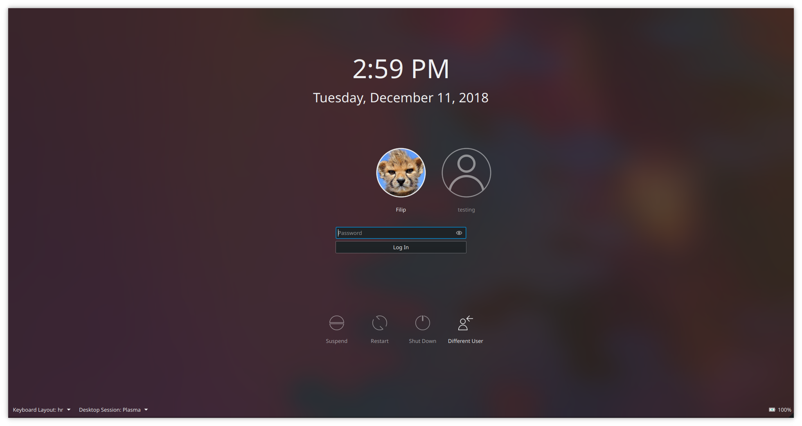
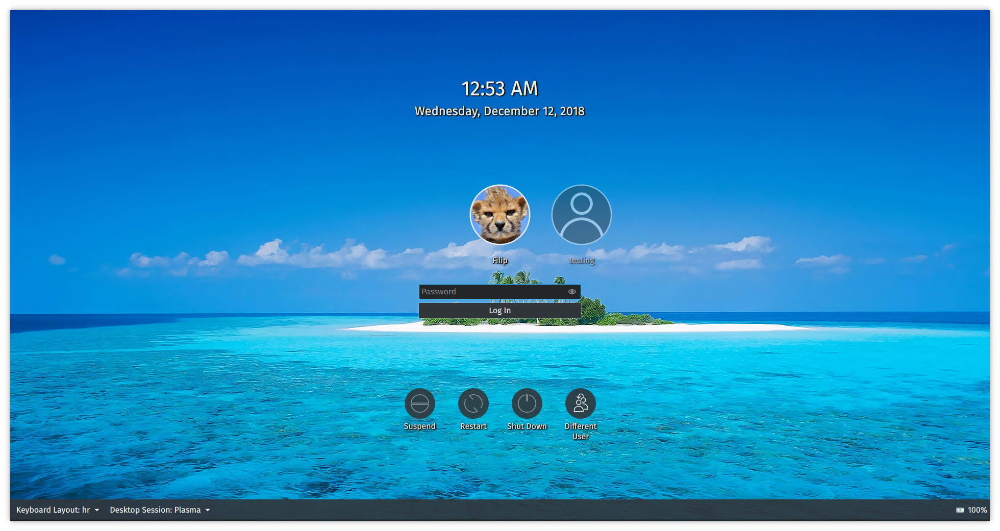

# Breeze 5.14 SDDM Theme Extended
Default look:

This is a fork of the default KDE Plasma 5.14 theme for SDDM.

The purpose of the fork is two-fold: to preserve the legacy 5.14 look and to provide many additional **configuration options**.

### Theming
Customized look: 

You can edit `theme.conf` to have the theme better suit your preferences. The options are explained in the file and vary from turning off blur to changing the font.

### Installation

1) KDE Store: "System Settings > Startup and Shutdown > Login Screen (SDDM) > Get New Theme".
2) Manually: copy to `/usr/share/sddm/themes/`

### Acknowledgments

Original code is taken from KDE Plasma's theme written by [David Edmundson](davidedmundson@kde.org).
